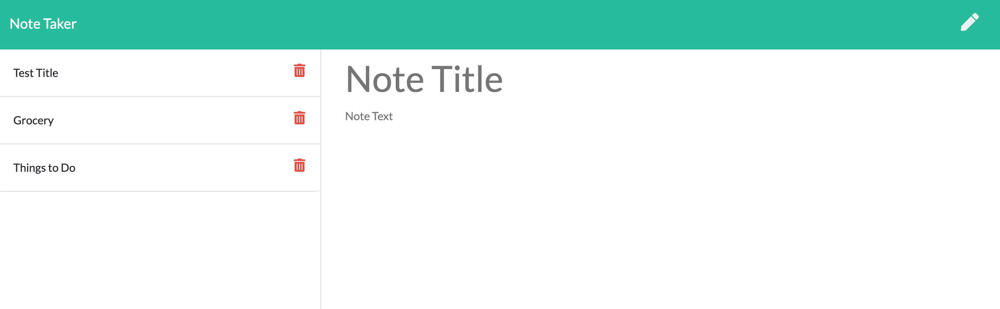

# express_note_taker

## Introduction

- As a student developer, the project was to create note taker.
- Deployed app: https://serene-tundra-22243.herokuapp.com/ (works on localhost:8000 when connected via Node and herokuapp)

## Table of Contents

1.  Description
2.  Techologies
3.  License

## Description:

1.  It is important everyone to have user friendly note taker.
2.  In this project, as a user, they should be able to write and save notes.
    - As user should also able to delete/view notes that they have written prreviously saved notes.
      - In that way user can organize thoughts and keep track of tasks that need to complete
3.  To take notes,

- The following HTML routes is created:

- GET `/notes` - Should return the `notes.html` file.

- GET `*` - Should return the `index.html` file

- The application have a `db.json` file on the backend that is used to store and retrieve notes using the `fs` module.

- The following API routes is created:

  - GET `/api/notes` - will read the `db.json` file and return all saved notes as JSON.

  - POST `/api/notes` - will receive a new note to save on the request body, add it to the `db.json` file, and then return the new note to the client.

  - DELETE `/api/notes/:id` - will receive a query parameter containing the id of a note to delete. Given each note a unique `id` when it's saved. In order to delete a note, need to read all notes from the `db.json` file, remove the note with the given `id` property, and then rewrite the notes to the `db.json` file.

4.  Techologies:
    - HTML5
    - CSS3
    - JavaScript
    - Node JS
    - VS-Code Editor
    - GitHub Repository
    - Heroku
    - npm packages
5.  Lincense:
    - MIT

